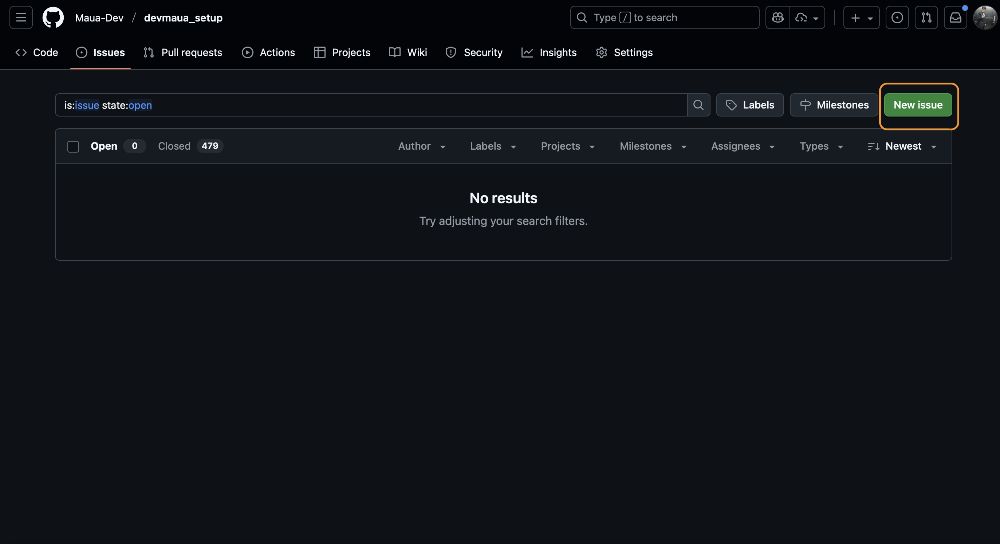
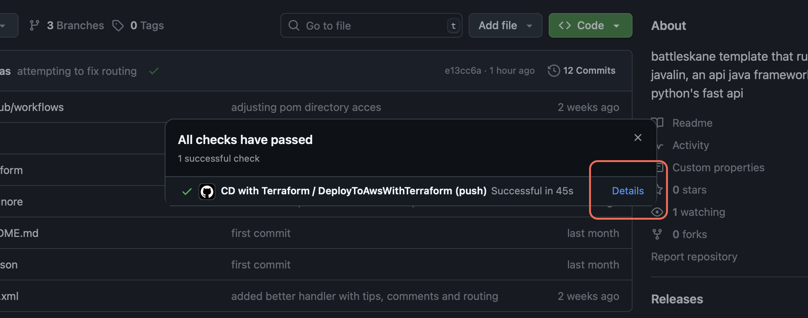
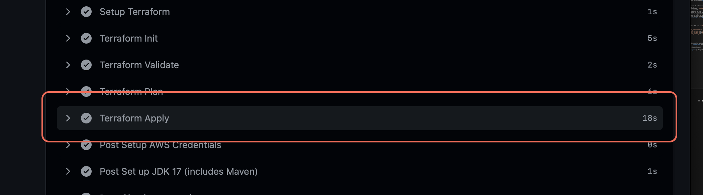
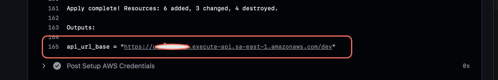

# 🐍 BattleSnake Lambda Java

Este projeto é um exemplo simples de integração do [BattleSnake](https://play.battlesnake.com/) usando **AWS Lambda** com **Java** e **API Gateway**.  
Ele foi escrito para rodar na AWS sem necessidade de servidor próprio, usando **Maven** para gerenciamento de dependências.

---

## 📦 Pré-requisitos

- **Java JDK** (versão 11 ou superior)  
  [Download do JDK](https://www.oracle.com/java/technologies/javase-downloads.html) ou use o OpenJDK.
- **Maven CLI**  
  [Download Maven](https://maven.apache.org/download.cgi)  
  Instalação:
  ```bash
  # Windows (chocolatey)
  choco install maven
  
  # Mac (homebrew)
  brew install maven
  
  # Linux (apt)
  sudo apt install maven
  ```
  [Documentação Para Windows Oficial](https://maven.apache.org/guides/getting-started/windows-prerequisites.html)
  [Video Tutorial Para Windows](https://www.youtube.com/watch?v=YTvlb6eny_0)

- Conhecimento básico sobre **API Gateway** e **Lambda**
- Conhecimento básico sobre **Java** 
- Conhecimento básico sobre **API**
- **Disposicão, Competitividade e Força de Vontade!**

---

## 📂 Estrutura do Projeto

O projeto segue a estrutura **Maven Standard Directory Layout**:

```
.
├── pom.xml                  # Arquivo de dependências Maven
├── src
│   ├── main
│   │   ├── java
│   │   │   └── com
│   │   │       └── mauadev
│   │   │           └── code
│   │   │               └── Handler.java   # Código principal!!!
│   │   └── resources
│   │       └── (se necessário, arquivos de configuração)
│   └── test
│       └── java (testes unitários)
```

---

## ⚙️ Dependências (`pom.xml`)

O `pom.xml`, nosso arquivo de dependencias, padrão para rodar este projeto:

```xml
<?xml version="1.0" encoding="UTF-8"?>
<project xsi:schemaLocation="http://maven.apache.org/POM/4.0.0 http://maven.apache.org/xsd/maven-4.0.0.xsd"
         xmlns="http://maven.apache.org/POM/4.0.0" xmlns:xsi="http://www.w3.org/2001/XMLSchema-instance">
    <modelVersion>4.0.0</modelVersion>

    <groupId>com.mauadev</groupId>
    <artifactId>battlesnake-lambda</artifactId>
    <version>1.0</version>

    <properties>
        <project.build.sourceEncoding>UTF-8</project.build.sourceEncoding>
        <maven.compiler.release>17</maven.compiler.release>
    </properties>

    <dependencyManagement>
        <dependencies>
            <dependency>
                <groupId>org.junit</groupId>
                <artifactId>junit-bom</artifactId>
                <version>5.10.2</version>
                <type>pom</type>
                <scope>import</scope>
            </dependency>
        </dependencies>
    </dependencyManagement>


    <dependencies>
        <dependency>
            <groupId>com.amazonaws</groupId>
            <artifactId>aws-lambda-java-core</artifactId>
            <version>1.2.3</version>
        </dependency>
        <dependency>
            <groupId>com.amazonaws</groupId>
            <artifactId>aws-lambda-java-events</artifactId>
            <version>3.13.0</version>
        </dependency>
        <dependency>
            <groupId>com.google.code.gson</groupId>
            <artifactId>gson</artifactId>
            <version>2.10.1</version>
        </dependency>

        <dependency>
            <groupId>org.junit.jupiter</groupId>
            <artifactId>junit-jupiter-api</artifactId>
            <scope>test</scope>
        </dependency>
        <dependency>
            <groupId>org.junit.jupiter</groupId>
            <artifactId>junit-jupiter-engine</artifactId>
            <scope>test</scope>
        </dependency>
    </dependencies>

    <build>
        <plugins>
            <plugin>
                <groupId>org.apache.maven.plugins</groupId>
                <artifactId>maven-compiler-plugin</artifactId>
                <version>3.13.0</version>
            </plugin>
            <plugin>
                <groupId>org.apache.maven.plugins</groupId>
                <artifactId>maven-surefire-plugin</artifactId>
                <version>3.2.5</version>
            </plugin>
            <plugin>
                <groupId>org.apache.maven.plugins</groupId>
                <artifactId>maven-shade-plugin</artifactId>
                <version>3.6.0</version>
                <executions>
                    <execution>
                        <phase>package</phase>
                        <goals>
                            <goal>shade</goal>
                        </goals>
                        <configuration>
                            <createDependencyReducedPom>false</createDependencyReducedPom>
                        </configuration>
                    </execution>
                </executions>
            </plugin>
        </plugins>
    </build>
</project>
```

---

## 🚀 Como começar

### 📦 Criar o repositório

1.  Vá até o repositório
    [**Setup**](https://github.com/Maua-Dev/devmaua_setup), acesse a aba
    **Issues** e abra uma nova issue.

    -   Escolha os parâmetros conforme mostrado nas imagens:\
        \
        

2.  Após abrir a issue, o repositório será criado automaticamente dentro
    da organização.\
    \> ⏳ Aguarde cerca de **1 minuto** e depois verifique em
    [Repositórios da
    organização](https://github.com/orgs/Maua-Dev/repositories).

3.  Clone o repositório criado na sua máquina:

    ``` bash
    # Na pasta em que deseja trabalhar, execute:
    git clone https://www.github.com/Maua-Dev/Nome_Do_Seu_Repositorio

    # Acesse a pasta do projeto
    cd Nome_Do_Seu_Repositorio

    # Instale as dependências
    mvn clean install
    ```

4.  Agora é só começar a programar sua cobra 🐍!

### 🧪 Testando seu código

Quando quiser testar ou salvar o progresso:

``` bash
# para testar o projeto com os testes padrões já criados rode:
mvn test
# esses testes serão automaticamente executados no GitHub # actions, então fique atento pois caso falhem o seu código não irá
# gerar o link da api!!!!!!
```

``` bash
# para enviar o código para o GitHub basta executar:
git add ./
git commit -m "sua mensagem de commit"
# caso seja o primeiro commit:
git push origin dev
# caso contrário: 
git push
```

Depois disso, acesse o repositório do seu projeto no GitHub para obter o
**link da API** gerada automaticamente.

## ☁️ Deploy na AWS Lambda

O processo de deploy deste projeto já está automatizado via **Terraform**.  
Não é necessário modificar nada no código ou no Terraform para implantar na AWS.

Assim que o Terraform concluir o deploy, será criada automaticamente uma URL pública do **API Gateway**.

---

## 🎯 Configurando no site do BattleSnake

1. Acesse sua conta no [BattleSnake](https://play.battlesnake.com/)
2. Vá até **My Battlesnakes** → **New Battlesnake**
3. Escolha um nome e uma cor para sua cobra
4. No campo **URL**, insira a URL gerada pelo Terraform (exemplo: `https://<ID>.execute-api.<REGIÃO>.amazonaws.com/`)






5. Salve as configurações
6. Agora você pode testar a cobra nos jogos e desafios!


---

## 📜 O que o código faz

O `Handler.java` implementa a interface do **AWS Lambda RequestHandler**, recebendo eventos do API Gateway e respondendo com JSON.

### Principais partes:
- **`handleRequest()`** → ponto de entrada da Lambda
  - Lê o **path** da requisição
  - Direciona para o método correto (`handleInfo`, `handleStart`, `handleMove`, `handleEnd`)
  - Retorna resposta JSON ou erro 404
- **`handleInfo()`** → informações da cobra (cor, cabeça, cauda, autor, versão da API)
- **`handleStart()`** → chamado no início do jogo (log inicial)
- **`handleMove()`** → lógica da jogada (neste exemplo, sempre "up")
- **`handleEnd()`** → chamado no final do jogo (log final)
- Usa **Gson** para converter objetos Java para JSON
- Usa **APIGatewayProxyRequestEvent** e **APIGatewayProxyResponseEvent** para receber/enviar dados

- **Documentação oficial do battlesnake!!!!!** → https://docs.battlesnake.com/api

---

## 🧪 Testando localmente

Você pode simular requisições HTTP com `curl`:

```bash
curl -X GET https://<SEU_API_GATEWAY_URL>/
curl -X POST https://<SEU_API_GATEWAY_URL>/start -d '{}'
curl -X POST https://<SEU_API_GATEWAY_URL>/move -d '{}'
curl -X POST https://<SEU_API_GATEWAY_URL>/end -d '{}'
```

Ou testar com os tests já criados:

```bash
mvn test
```

---

## 📌 Observações

- O método `handleMove()` deve conter a inteligência do jogo.  
- O uso do **maven-shade-plugin** é obrigatório para empacotar todas as dependências no JAR final.
- **EVITE** adicionar mais dependencias, pois o shade plugin empacota **todas as dependencias** em um JAR, tornando-o **talvez muito pesado** para o deploy!!!
